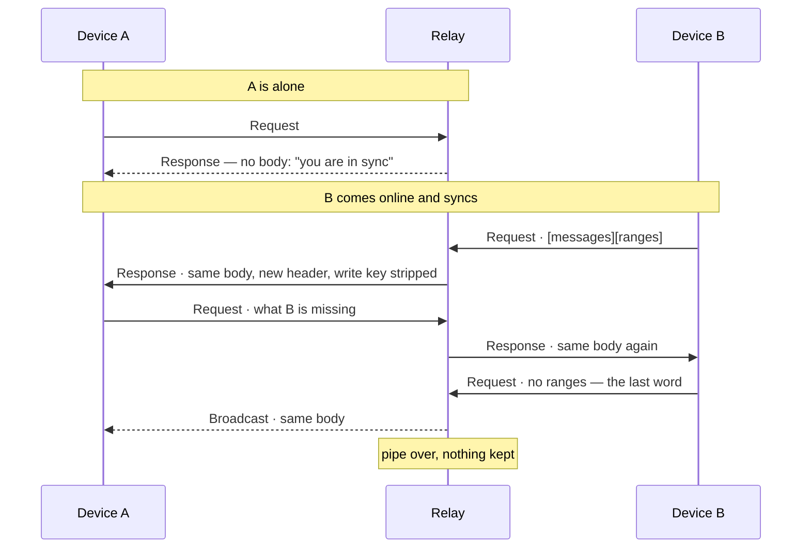

# evolu-live-relay

[](https://github.com/finitoapp/evolu-live-relay/actions/workflows/code-quality.yml)

A relay for [Evolu](https://www.evolu.dev) that **stores nothing**. It pairs the
devices of one owner while they are online together and pipes their sync rounds
at each other, so they reconcile end to end. No database, no message log, no
history — when the last socket closes, nothing is left.

Hence *live*: **if two devices are not online at the same time, no data moves.**
A device that was offline while another one wrote is not caught up by this. That
is the trade for a relay you can run on a free Cloudflare plan and forget about.

A stock Evolu client talks to it unchanged.

## How it works

**The two devices reconcile with each other; the relay only decides who talks
to whom.** It runs none of the sync itself — no fingerprints, no diffing, no
idea what any of it means.

It can do that because Request, Response and Broadcast carry the same
`[messages][ranges]` body and differ only in a few header bytes. A round from
one device is re-headered and handed to another, which answers it as if it had
come from the relay. The only thing read out of a round is two counts — does it
carry data, does the sender want another round — and those are forgotten as
soon as it is routed.



[DESIGN.md](./DESIGN.md) has the whole thing: the protocol facts it rests on,
the routing rules, and — importantly — what it deliberately does not do.

## What happens when

| Situation | What the relay does |
| :-- | :-- |
| One device online | Answers "you are in sync" and drops the round. Nothing is stored, so there is nothing to hand it later. |
| Two devices online | Pairs them and pipes rounds back and forth until one sends a round with no ranges. Both end up holding the union. |
| Three or more | One pair talks; every other device gets a Broadcast copy of everything that crosses, so all of them converge. |
| A device joins mid-conversation | Its first round waits until the running pipe goes quiet, then goes through. That wait is what makes "everyone holds the union" true when several devices connect at once. |
| A partner goes quiet mid-round | After 800 ms the round is offered to the next device, newest first, one at a time. Nobody is asked twice. |
| Nobody answers | The sender is told "you are in sync" — the same answer a lone device gets, because it is the same situation. Its data already went out as a Broadcast, and the next device to join repairs it. |
| A device was offline while another wrote | **Nothing.** There is no catch-up. They reconcile the next time both are online. |
| A device's network dropped | Its socket lingers but is never picked as a partner — pairing prefers the newest free one. Locally, pings reap it in ~30 s. |
| The relay restarts, or the Durable Object hibernates | A round waiting for a partner can be lost. Devices re-reconcile on their next sync; nothing was on disk to lose. |

## Run it locally

```sh
bun install
bun run start --port 4000
```

Browsers only allow `wss://` from an https page, so you need a certificate for
anything but a quick test:

```sh
mkcert -install
mkcert -key-file key.pem -cert-file cert.pem localhost 127.0.0.1 ::1
bun run start --port 4000 --cert cert.pem --key key.pem
```

`--cert` on its own also takes a single PEM holding both key and certificate.

> The certificate has to be **trusted**, not click-through accepted. Evolu opens
> its sync sockets inside a SharedWorker, which has no tab behind it, so a
> browser cannot ask you there — it just fails, silently, forever. `mkcert`
> installs a local CA, which is why it is the short way out. A phone needs that
> CA installed too, or has to reach the relay over a port forward
> (`adb reverse tcp:4000 tcp:4000`).

## Point a client at it

The whole address is a room id, and one room is one owner:

```
wss://<host>/<roomId>
```

The owner is not in the URL. Every message carries it in its header, so the
relay reads it from the first round it is given — which keeps an owner id out
of URLs, and therefore out of logs, proxies and devtools.

`<roomId>` is opaque to the relay: one path segment of letters, digits, `-` and
`_`, at most 64 characters. Anything of that shape routes, so `/abc` works —
but a room id's only security is that it cannot be guessed, so derive a real
one from the owner's secret and let every device compute the same room:

```ts
const secret = mnemonicToOwnerSecret(evolu.appOwner.mnemonic)
const roomId = idBytesToId(
  IdBytes.orThrow(
    createSlip21(secret, ["evolu-live-relay", "RoomId"]).slice(0, 16)
  )
)

const evolu = createEvolu(schema, {
  appOwner,
  transports: [{ type: "WebSocket", url: `wss://<host>/${roomId}` }],
})
```

That is the recipe Evolu uses for the owner id itself, under a different
SLIP-21 label, so the room id is a sibling of the owner id rather than
something derived from it: knowing an owner id does not reveal its room. See
DESIGN.md §6 for what that does and does not buy — it is an unguessable
address, not authentication.

> Note `transports` takes the URL as it is. Do **not** wrap it in
> `createOwnerWebSocketTransport`: that helper appends `?ownerId=`, which this
> relay has no use for and which puts the owner id back in the URL.

## Deploy to Cloudflare

One Durable Object per room is where that owner's devices meet — the one
primitive that gives two live sockets the same single-threaded place to talk.

```sh
bunx wrangler login
bun run deploy
```

The class is registered as SQLite-backed because those are the ones the free
plan offers; it never writes a row. The only storage API it touches is the alarm
clock. Add a custom domain by putting it in `wrangler.toml`:

```toml
routes = [{ pattern = "relay.example.com", custom_domain = true }]
```

The first deploy creates the Worker and applies the `v1` migration that
registers the Durable Object class. There is no manual step for it.

### Deploying from CI

`.github/workflows/deploy.yml` deploys every push to `main`, after the checks
pass — it calls `code-quality.yml` as a reusable workflow and only runs
`wrangler deploy` if that job succeeds. Two repository secrets are needed
(**Settings → Secrets and variables → Actions**):

| Secret | Where to get it |
| :-- | :-- |
| `CLOUDFLARE_API_TOKEN` | Cloudflare → My Profile → API Tokens → Create Token → **Edit Cloudflare Workers** template, scoped to your account. The minimum is Account → Workers Scripts → Edit; a custom domain route also needs Zone → Workers Routes → Edit. |
| `CLOUDFLARE_ACCOUNT_ID` | Workers & Pages in the dashboard, or `bunx wrangler whoami`. |

Set them **before** the first push to `main`, or that run fails at the deploy
step. The job declares `environment: production`, so GitHub creates that
environment on the first run; add required reviewers there if a deploy should
wait for a human, or move the two secrets into it to scope them to this job.

## Limits worth knowing before you use it

- **No catch-up.** Both devices must be online together. This is the design, not
  a bug.
- **The room id is an unguessable address, not authentication.** The relay
  verifies nothing, and cannot: SLIP-21 has no public half, so there is nothing
  to check a device against. Reaching a room takes the owner's secret, and
  inside one the first write key seen wins while it has connections. Payloads
  stay end-to-end encrypted and a client quarantines what it cannot decrypt.
- **No rate limiting, no backpressure, no quotas.**
- It rests on Evolu internals — clients processing unsolicited messages, and a
  copied reader for the wire format. Both fail safe, and both can drift on an
  Evolu upgrade. See DESIGN.md §6 for the full list.

## Development

```sh
bun run check       # biome + tsc + vitest
bun run test        # vitest
bun run dev:worker  # wrangler dev
```

The relay is written once and hosted twice. `src/wire.ts` is the byte layer and
`src/routing.ts` the pure routing decision; `src/relay.ts` is the relay itself,
the state machine built on those two; and `src/server.ts` (Bun) and
`src/worker.ts` (Cloudflare Durable Object) are thin adapters that give it
sockets, a clock and a place to keep per-socket state.

The tests follow the same lines: `routing.test.ts` for the routing decision,
`wire.test.ts` for the wire-format reader against Evolu's own encoder — that
one is the alarm for the day the format moves — `relay.test.ts` for the state
machine against a fake host and a hand-moved clock, and `server.test.ts` for
the Bun adapter over a real WebSocket.

## License

MIT
